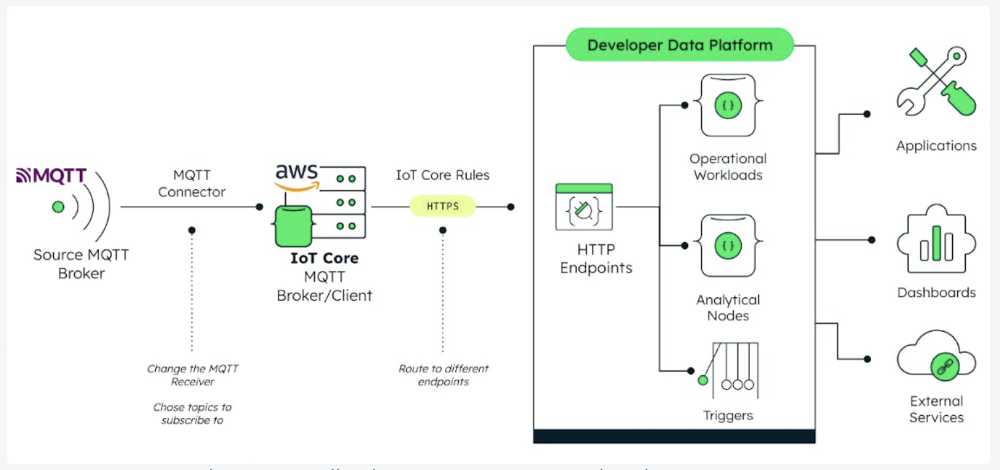

DOCUMENTAÇÃO DO PROJETO
Empresa LumenAI
Versão do documento: 1

  * 1. Contextualização do Projeto
    * 1.1. Objetivo do projeto
    * 1.2. Visão geral
    * 1.3. Justificativa
  * 2. Requisitos
    * 2.1. Requisitos Funcionais
    * 2.2. Requisitos Não Funcionais
    * 2.3. Casos de Uso
  * 3. Premissas e Restrições
    * 3.1. Premissas
    * 3.2. Restrições
  * 4. Arquitetura do Sistema
    * 4.1. Diagrama de Arquitetura
    * 4.2. Componentes do Sistema
    * 4.3. Integrações Externas
  * 5. Descrição Funcional
  * 6. Desenvolvimento
    * 6.1. Tecnologias Utilizadas
    * 6.2. Metodologia de Desenvolvimento
  * 7. Testes
    * 7.1. Casos de Teste
    * 7.2. Resultados dos testes
    * 7.3. Testes de integração
    * 7.4. Testes de aceitação
  * 8. Gerenciamento de projeto
    * 8.1. Cronograma
    * 8.2. Orçamento
    * 8.3. Riscos e Mitigações
    * 8.4. Equipe
  * 9. Conclusão e Entrega
    * 9.1. Resumo do Projeto
    * 9.2. Entrega
  * 10. Anexos

# 1. Contextualização do Projeto 

**Projeto**: Sistema de Otimização de Consumo Energético (SOCE)

A LumenAI desenvolve o SOCE com o objetivo de minimizar o consumo de energia em edifícios comerciais e residenciais.

A iniciativa responde ao aumento dos custos de energia e à necessidade de práticas sustentáveis, empregando inteligência artificial (IA) e Internet das Coisas (IoT) para análise e otimização do consumo de energia. 

Esta abordagem é vital para o futuro energético, permitindo reduções significativas no consumo de energia e promovendo a sustentabilidade.

## 1.1. Objetivo do projeto 

**Objetivo Geral**: Criar um sistema que reduza o custo de energia em até 30% para os clientes da LumenAI.

**Objetivos Específicos**:

1. Analisar padrões de consumo de energia utilizando algoritmos de IA para identificar áreas de otimização.

1. Automatizar o controle de dispositivos elétricos, integrando com tecnologias de IoT para efetuar ajustes em tempo real visando a economia de energia.

1. Gerar relatórios detalhados e recomendações personalizadas para os clientes, ajudando-os a entender e melhorar seu consumo de energia.

## 1.2. Visão geral 

O SOCE se posicionará como uma solução chave para a redução do consumo de energia, empregando algoritmos avançados de aprendizado de máquina para analisar e otimizar o uso de energia. 

O sistema não só almeja uma redução significativa nos custos de energia para os usuários finais, mas também visa estabelecer um novo padrão em eficiência energética e práticas de consumo sustentável. 

A implementação bem-sucedida do SOCE será um marco importante na jornada da sustentabilidade e eficiência energética.

## 1.3. Justificativa 

A demanda por soluções que contribuam para a economia de energia está em ascensão, especialmente em um contexto onde a sustentabilidade se torna cada vez mais crucial. 

O desenvolvimento do SOCE é essencial para atender a essa necessidade, oferecendo uma gestão inteligente de energia que vai além da simples redução de custos. 

O projeto tem o potencial de transformar significativamente a forma como a energia é consumida e gerida, contribuindo para a preservação de recursos e para um futuro mais sustentável.              

# 2. Requisitos 

## 2.1. Requisitos Funcionais 

RF001 - Coleta e análise de dados de consumo de energia em tempo real.

RF002 - Sistema de controle automatizado para dispositivos elétricos, capaz de realizar ajustes baseados em análises preditivas.

RF003 - Geração de relatórios e recomendações de economia com base nos dados coletados e analisados.

## 2.2. Requisitos Não Funcionais 

RNF001 - Alta disponibilidade e confiabilidade para garantir o monitoramento contínuo.

RNF002 - Segurança robusta dos dados coletados, assegurando a privacidade e a conformidade com regulamentações.

RNF003 - Interface intuitiva para o usuário, facilitando o acesso e a compreensão dos dados e relatórios.

## 2.3. Casos de Uso 

UC1 - Coleta de dados de consumo energético: Coletar dados de diferentes dispositivos e fontes de energia.

UC2 - Otimização automatizada do consumo: Utilizar IA para otimizar o uso de energia em tempo real.

UC3 - Geração de relatórios de economia: Produzir relatórios detalhados e recomendações personalizadas para os clientes.

# 3. Premissas e Restrições 

## 3.1. Premissas 

1. Acesso a dados de consumo de energia em tempo real através de sensores e dispositivos IoT.

1. Colaboração contínua com fornecedores de energia para integração de dados e sistemas.

## 3.2. Restrições 

1. Dependência de integração com dispositivos inteligentes e IoT.

1. Necessidade de conformidade com regulamentações de privacidade e proteção de dados.

# 4. Arquitetura do Sistema 

## 4.1. Diagrama de Arquitetura 

## 4.2. Componentes do Sistema 

**Módulo de Coleta de Dados**: Responsável pela aquisição de dados de consumo de energia de diversas fontes.

**Módulo de Otimização de Consumo**: Utiliza IA para analisar dados e otimizar o uso de energia.

**Interface de Usuário**: Permite aos usuários visualizar dados, relatórios e controlar configurações.

## 4.3. Integrações Externas 

1. Integração com dispositivos de IoT para coleta de dados e controle automatizado.

1. APIs de fornecedores de energia para acesso a informações complementares e integração de sistemas.

# 5. Descrição Funcional 

A funcionalidade do SOCE é projetada para fornecer uma experiência de usuário intuitiva e eficaz, garantindo que o consumo de energia seja otimizado de forma inteligente e automática.

**Funcionalidades Principais**:

* Monitoramento de Consumo: Sensores capturam informações de consumo e as enviam para a unidade central de processamento.

* Análise de Dados: A análise é feita continuamente, ajustando-se a mudanças no comportamento de consumo e a eventos externos, como variações climáticas.

* Otimização Automática: Controles inteligentes são aplicados para regular o aquecimento, ar-condicionado, iluminação e outros dispositivos, maximizando a eficiência energética.

* Alertas e Notificações: Notificações são enviadas em tempo real para dispositivos dos usuários, permitindo ação rápida quando necessário.

**Interoperabilidade**:

* O SOCE é compatível com uma ampla variedade de dispositivos e sistemas, permitindo a integração com diferentes fontes de dados e fornecedores de energia.

**Segurança e Privacidade**:

* São implementadas medidas avançadas de segurança para proteger os dados de consumo de energia dos usuários e garantir a conformidade com as leis de privacidade de dados.

**Usabilidade**:

* O design da interface de usuário é centrado no usuário, garantindo que mesmo indivíduos sem conhecimento técnico possam operar o sistema eficazmente.

# 6. Desenvolvimento 

## 6.1. Tecnologias Utilizadas 

Para o desenvolvimento do SOCE, diversas tecnologias serão empregadas, tanto para a construção do sistema quanto para a integração com dispositivos:

**Backend**:

* Linguagem: Python, devido à sua ampla utilização em aplicações de IA e big data.

* Frameworks de IA: TensorFlow ou PyTorch para o desenvolvimento de algoritmos de aprendizado de máquina.

**Frontend**:

* Angular: Uma plataforma robusta e moderna para desenvolver a interface de usuário.

**Banco de Dados**:

* MongoDB: Banco de dados NoSQL para armazenar grandes volumes de dados de forma eficiente.

**Integração com Dispositivos IoT**:

* Protocolos de Comunicação: MQTT e CoAP para comunicação leve e eficiente.

* Zigbee e Z-Wave: Para conexão sem fio de baixa potência.

* Bluetooth Low Energy (BLE): Para dispositivos portáteis e sensores.

* APIs RESTful e WebSocket: Para criar interfaces padronizadas e comunicação em tempo real.

**Segurança**:

* TLS/SSL: Para comunicação segura e criptografada.

* Mecanismos de Autenticação e Autorização: Como OAuth.

**Infraestrutura de Cloud e Big Data**:

* Plataformas como AWS IoT: Para gerenciamento e análise de dados.

* Apache Kafka: Para processamento de stream em tempo real.

## 6.2. Metodologia de Desenvolvimento 

**Metodologia Ágil**:

* Scrum - Será utilizado para gerenciar o processo de desenvolvimento, com sprints regulares e revisões frequentes.

**Integração Contínua e Entrega Contínua (CI/CD)**: 

* Para garantir que o código seja integrado e testado frequentemente, permitindo lançamentos ágeis e estáveis.

**Planejamento e Execução**:

* Reuniões de Sprint - Realizadas para planejar as atividades e revisar o progresso.

* Revisões de Código e Pair Programming - Para manter a qualidade e a consistência do código.

**Feedback e Melhoria Contínua**:

* Revisões com Stakeholders - Incluindo demonstrações do produto para obter feedback.

* Retrospectivas de Sprint - Para identificar e implementar melhorias no processo de desenvolvimento.

**Ferramentas de Gestão de Projetos**:

* JIRA: Para rastrear tarefas e progresso.

* Git para controle de versão: Assegurando que todas as mudanças de código sejam adequadamente documentadas e rastreadas.

# 7. Testes 

## 7.1. Casos de Teste 

1. Testar a eficiência da coleta de dados em diferentes ambientes e condições.

1. Avaliar a eficácia da otimização do consumo de energia, visando uma redução de até 30%.

1. Verificar a precisão e a utilidade dos relatórios gerados.

## 7.2. Resultados dos testes 

1. Coleta de dados eficiente

1. Otimização com redução de até 30%

1. Relatórios detalhados e precisos.

## 7.3. Testes de integração 

1. Integração com dispositivos IoT para assegurar comunicação e controle eficazes.

1. Comunicação com APIs de fornecedores de energia para validação de integração de dados.

## 7.4. Testes de aceitação 

1. Avaliação da satisfação do cliente com a economia de energia alcançada.

1. Testes da usabilidade da interface do usuário, garantindo facilidade de uso e compreensão.

# 8. Gerenciamento de projeto 

## 8.1. Cronograma 

**Análise de Requisitos**: De 01/01/2024 a 15/01/2024, liderada por Ana Pereira.

**Desenvolvimento**: De 16/01/2024 a 30/06/2024, sob a liderança de Carlos Dias.

| Cronograma|
|---|
| Entrega |Data de início |Data de conclusão |Responsável|
|---|---|---|---|
|Análise de Requisitos |01/01/2024 |15/01/2024 |Ana Pereira|
|Desenvolvimento |16/01/2024 |30/06/2024 |Carlos Dias|

## 8.2. Orçamento 

| Orçamento|
|---|
| Elemento da despesa |Valor específico |Valor geral|
|---|---|---|
|Desenvolvimento |R$ 300.000 |R$ 600.000|
|Marketing |R$ 50.000 |R$ 600.000|

## 8.3. Riscos e Mitigações 

Risco de atraso no cronograma: Implementação de recursos adicionais e revisão constante do escopo.

Risco tecnológico: Parcerias estratégicas com especialistas em IA e IoT.

## 8.4. Equipe 

| Equipe|
|---|
| Nome |Função|
|---|---|
|Ana Pereira |Analista de Requisitos|
|Carlos Dias |Líder de Desenvolvimento|
|João Silva |Desenvolvedor|
|Maria Santos |Desenvolvedora|
|Pedro Oliveira |Desenvolvedor|
|Sofia Costa |SRE|
|Tiago Rodrigues |DBRE|

# 9. Conclusão e Entrega 

## 9.1. Resumo do Projeto 

O SOCE da LumenAI é uma solução inovadora para a otimização do consumo de energia, promovendo eficiência energética e sustentabilidade.

## 9.2. Entrega 

O projeto foi entregue com sucesso, atendendo às expectativas de economia de energia e recebendo feedback positivo dos clientes.

# 10. Anexos 

[Anexo1](https://www.mongodb.com/blog/post/real-time-inventory-tracking-computer-vision-atlas)

